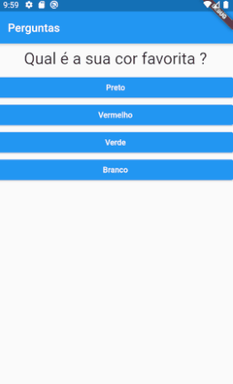

<h1 align="center">Aplicativo Questionário | Flutter</h1>

<h1 align="center">

</h1>

# Indice
- [Sobre](#-sobre)
- [Tecnologias utilizadas](#-tecnologias-utilizadas)
- [Como baixar o projeto](#-como-baixar-o-projeto)

# 📜 Sobre
Aplicativo simples de questionário desenvolvido em **Flutter** com intuito de se colocar em pratica todo o conteúdo estudado até o momento.

---

## 👨‍💻 Tecnologias utilizadas

O projeto foi desenvolvido utilizando as seguintes tecnologias:

- [Dart](https://dart.dev/)
- [Flutter](https://flutter.dev/)
---
## 📦 Como baixar o projeto

```bash

# Clonar o repositório
$git clone https://github.com/harlleybastos/Aplicativo-Perguntas-Flutter.git

#Acessar o repositório
$cd Aplicativo-Perguntas-Flutter

#Instalar as dependencias
$yarn install

#Iniciar o projeto
$yarn start

```
---
## Icones

- :package: Nova funcionalidade
- :up: Atualização
- :beetle: Correção de bug
- :checkered_flag: Release
---
Desenvolvido 👨‍💻 por Harlley dos Santos Bastos
